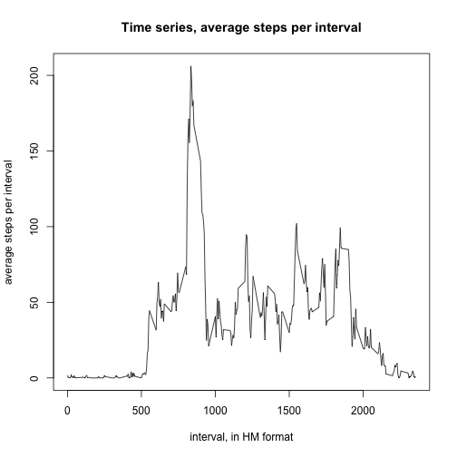

## Loading and preprocessing the data
In this assignment, we will examine data from a personal movement recording device.  61 days of step counts are captured in this data set. The number of steps are counted in 288 5-minute intervals per day. The data set is available at <https://d396qusza40orc.cloudfront.net/repdata%2Fdata%2Factivity.zip>, and should be downloaded and unzipped to your working directory. Make sure the data file "activity.csv" is available in your working directory before running this script.

The first chunk reads the .csv file into a data frame called "activity", and loads several library packages for later processing.


```r
activity <- read.csv("./activity.csv", stringsAsFactors = FALSE)
library(dplyr)
library(lubridate)
library(lattice)
library(ggplot2)
```
  
Use dplyr functions to determine the total number of steps each day, and then view the distribution of steps per day plotted as a histogram:


```r
        # group by date, and summarize steps with a sum function within each group
dateSteps <- summarize(group_by(activity, date), sumSteps = sum(steps))
hist(dateSteps$sumSteps, density = 15, main = "Histogram: Distribution of total steps per day", xlab = "total steps", ylab = "Count of days")
```

 

## What is mean total number of steps taken per day?
The calculations are shown below for the mean ("meanSteps") and median ("medianSteps") total number of steps per day:


```r
meanSteps <- mean(dateSteps$sumSteps, na.rm = TRUE)
meanStepsR <- paste("The mean value of steps per day is", round(meanSteps, digits = 3))
medianSteps <- median(dateSteps$sumSteps, na.rm = TRUE)
medianStepsR <- paste("The median value of steps per day is", round(medianSteps, digits = 3))
meanStepsR
```

```
## [1] "The mean value of steps per day is 10766.189"
```

```r
medianStepsR
```

```
## [1] "The median value of steps per day is 10765"
```


## What is the average daily activity pattern?
Calculate the average number of steps for each interval, and create the data frame "activityInterval". Use this to draw a time-series plot of the average number of steps per interval, averaged across all days.

```r
        # group by interval, then calculate the average steps per interval
activityInterval <- summarize(group_by(activity, interval), 
                              avgSteps = mean(steps, na.rm=TRUE))
with(activityInterval, plot(interval, avgSteps, type = "l", xlab = "interval, in HM format", ylab = "average steps per interval", main = "Time series, average steps per interval"))
```

 

#### Which 5-minute interval, on average across all the days in the dataset, contains the maximum number of steps?
We can determine this by again averaging the number of steps for each interval across the days and finding the maximum value.


```r
maxInterval <- filter(activityInterval, avgSteps == max(activityInterval$avgSteps))

maxIntervalR <- paste("So, interval", maxInterval[1,1], "had the maximum average number of steps at", round(maxInterval[1,2], digits=3), "for the interval.")
maxIntervalR
```

```
## [1] "So, interval 835 had the maximum average number of steps at 206.17 for the interval."
```


## Imputing missing values
#### Calculate and report the total number of missing values in the dataset (i.e. the total number of rows with NAs).


```r
missingValues <- sum(is.na(activity))
missingValuesR <- paste("The total number of missing values is", missingValues)
missingValuesR
```

```
## [1] "The total number of missing values is 2304"
```

#### Devise a strategy for filling in all of the missing values in the dataset.
The strategy is to use "avgSteps", the mean number of steps (rounded to nearest integer) for each interval, as the replacement value for the NAs found in "step". The value of "interval" determines the value for "avgStep". So, e.g. for interval = 0, avgSteps = 2. "avgSteps" was calculated in the data frame "activityInterval".


#### Create a new dataset that is equal to the original dataset but with the missing data filled in.
For comparison to the new "steps" column with the imputed values, the original "steps" column is duplicated and named "orig_steps".

```r
        # creates a column of rounded values for avgSteps
activityInterval <- mutate(activityInterval, avgStepsR = round(avgSteps))
        # duplicates the original "steps" column
activity$orig_steps <- activity$steps 
        # combines avgSteps with activity  by the interval value
activity <- left_join(activity, activityInterval, by = "interval")
        # this replaces the NAs with avgSteps
activity$steps[is.na(activity$steps)] <- activity$avgStepsR[is.na(activity$steps)]
        # clean up unneeded columns
activity <- select(activity, -avgSteps, -avgStepsR)
```


#### Make a histogram of the total number of steps taken each day...
As before, the total number of steps per day are calculated; calculations are done for the original data (with NA's) and the new data (with imputed values replacing the NA's). 


```r
dateSteps <- summarize(group_by(activity, date), sumNewSteps = sum(steps), sumOrigSteps = sum(orig_steps))
par(mfrow = c(1,2), mar = c(4, 4, 4, 1), oma = c(0, 0, 2, 0))
with(dateSteps, {
        hist(sumOrigSteps, main = NULL, col = "springgreen3", xlab = "Steps with NAs", ylab = "days")
        hist(sumNewSteps, main = NULL, col = "burlywood3", xlab = "Steps with imputed", ylab = NULL)
        mtext("Distribution of total steps per day", outer = TRUE)
})
```

 

#### Calculate and report the mean and median total number of steps taken per day. 


```r
meanImpSteps <- round(mean(dateSteps$sumNewSteps), digits = 3)
meanImpStepsR <- paste("The mean number of steps per day for the new data is", meanImpSteps)
medianImpSteps <- round(median(dateSteps$sumNewSteps), digits = 3)
medianImpStepsR <- paste("The median number of steps per day for the new data is", medianImpSteps)
meanImpStepsR
```

```
## [1] "The mean number of steps per day for the new data is 10765.639"
```

```r
medianImpStepsR
```

```
## [1] "The median number of steps per day for the new data is 10762"
```
#### Do these values differ from the estimates from the first part of the assignment? 
Yes, these values differ from the first estimates made with the original data containing NAs, but only by a small amount.

#### What is the impact of imputing missing data on the estimates of the total daily number of steps?


```r
diffAvgSteps <- paste("The mean value with imputed data is", (((meanImpSteps - meanSteps)/(meanSteps)) * 100) + 100, "% of the original mean value.")
diffAvgSteps
```

```
## [1] "The mean value with imputed data is 99.9948943933488 % of the original mean value."
```

```r
diffMedSteps <- paste("The median value with imputed data is", (((medianImpSteps - medianSteps)/(medianSteps)) * 100) + 100, "% of the original median value.")
diffMedSteps
```

```
## [1] "The median value with imputed data is 99.9721319089642 % of the original median value."
```

## Are there differences in activity patterns between weekdays and weekends?
Use the weekdays() function to assign days of the week to the dates in the data.

#### Create a new factor variable in the dataset with two levels -- "weekday" and "weekend", indicating whether a given date is a weekday or weekend day.


```r
        # creates a column of weekdays, according to the date
activity$wdays <- (weekdays(ymd(activity$date)))
        # subset the data into two data frames to separate weekdays from weekends
weekend <- filter(activity, wdays == "Saturday" | wdays == "Sunday")
weekday <- filter(activity, wdays != "Saturday" & wdays != "Sunday")
        # create a new column in each new data frame and assign the appropriate weekday/weekend value
weekday$dayFactor <- "weekday"
weekend$dayFactor <- "weekend"
        # combine the weekday and weekend data frames to recreate the original data frame, but with the new column "dayFactor"
activity <- bind_rows(weekday, weekend)
str(activity)
```

```
## Classes 'tbl_df', 'tbl' and 'data.frame':	17568 obs. of  6 variables:
##  $ steps     : num  2 0 0 0 0 2 1 1 0 1 ...
##  $ date      : chr  "2012-10-01" "2012-10-01" "2012-10-01" "2012-10-01" ...
##  $ interval  : int  0 5 10 15 20 25 30 35 40 45 ...
##  $ orig_steps: int  NA NA NA NA NA NA NA NA NA NA ...
##  $ wdays     : chr  "Monday" "Monday" "Monday" "Monday" ...
##  $ dayFactor : chr  "weekday" "weekday" "weekday" "weekday" ...
```

#### Make a panel plot containing a time series of the 5-minute interval (x-axis) and the average number of steps taken, averaged across all weekday days or weekend days (y-axis).
The charts below show a shift in patterns of steps per interval between weekends and weekdays. Note the change in interval position for the peak of the blue dashed loess smoother line.

```r
activityWeek <- summarize(group_by(activity, interval, dayFactor), 
                              avgSteps = mean(steps))
activityWeek <- transform(activityWeek, dayFactor = factor(dayFactor))
g <- ggplot(activityWeek, aes(interval, avgSteps))
p <- g + geom_line() + facet_wrap(~ dayFactor, nrow = 2, ncol = 1) + geom_smooth(se = FALSE, color = "steelblue", linetype = 2) + theme_light() + labs(title = "Compare average steps per interval, weekdays vs. weekends") + labs(x = "interval, in HM format") + labs(y = "average steps per interval")
print(p)
```

```
## geom_smooth: method="auto" and size of largest group is <1000, so using loess. Use 'method = x' to change the smoothing method.
## geom_smooth: method="auto" and size of largest group is <1000, so using loess. Use 'method = x' to change the smoothing method.
```

 
